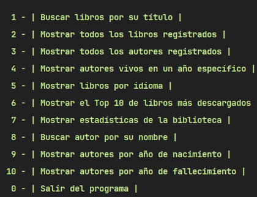
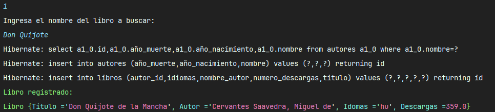
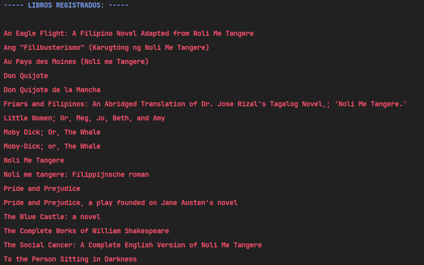
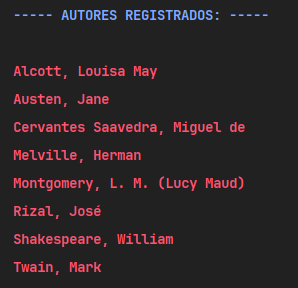
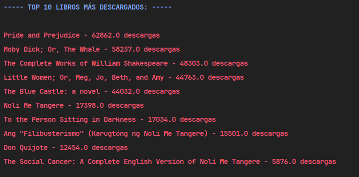

# Literalura

Proyecto desarrollado como parte del Bootcamp Alura-ONE Oracle. Desarrollado por [Mario Serrano](https://github.com/Mario0SGz), del grupo G6-2024.

## Descripción del Proyecto

Literalura es una aplicación en Java que permite buscar, registrar y gestionar libros y autores utilizando una API pública. La aplicación proporciona diversas funcionalidades para mejorar la experiencia del usuario y facilitar la gestión de la información literaria.

### Funcionalidades

- **Buscar libros por título**: Permite buscar libros por su título utilizando la API de Gutendex.
- **Listar libros registrados**: Muestra una lista de todos los libros registrados en la base de datos.
- **Listar autores registrados**: Muestra una lista de todos los autores registrados en la base de datos.
- **Listar autores vivos en un determinado año**: Filtra y muestra los autores que estaban vivos en un año específico.
- **Listar libros por idioma**: Filtra y muestra los libros disponibles en un idioma específico.
- **Top 10 libros más descargados**: Muestra los 10 libros más descargados.
- **Obtener estadísticas**: Muestra estadísticas generales sobre los libros y autores registrados.
- **Buscar autor por nombre**: Permite buscar un autor específico por su nombre.
- **Listar autores por año de nacimiento**: Filtra y muestra los autores nacidos en un año específico.
- **Listar autores por año de fallecimiento**: Filtra y muestra los autores fallecidos en un año específico.

## Instrucciones de Uso

1. Clona este repositorio.
2. Abre el proyecto en tu IDE de Java favorito.
3. Asegúrate de tener configurada la conexión a tu base de datos.
4. Ejecuta la clase `Principal.java`.
5. Sigue las instrucciones en pantalla para navegar por el menú y utilizar las funcionalidades disponibles.

## Capturas de Pantalla de algunas Opciones Disponibles

##Menú

## Opcion 1

## Opcion 2

## Opcion 3

## Opcion 6

## Contribución

Las contribuciones son bienvenidas. Si tienes ideas para mejorar este proyecto, no dudes en contribuir.
